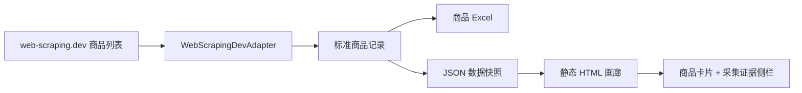

# web-scraping.dev 商品采集与可视化画廊设计

## 目标

在现有豆瓣电影采集 Demo 之外，接入第二个明确用于网页抓取练习的目标网站
`web-scraping.dev`，完成一条可独立验收的商品采集链路：

```text
商品列表分页
  -> 商品链接发现与去重
  -> 商品详情解析
  -> 标准商品记录
  -> Excel + JSON
  -> 静态 HTML 可视化画廊
```

本轮重点不是扩大采集规模，而是验证 DataAnt 能否在不污染现有电影模型的前提下，
增加一个具有独立数据模型、页面适配器、输出契约和离线测试体系的新站点。

最终成果既要便于机器校验，也要让人能够直观感受采集效果。静态画廊采用
“商品卡片 + 采集证据侧栏”的布局：卡片负责视觉呈现，侧栏负责展示来源、状态和完整字段。

## 现状与设计依据

当前项目已经具备：

- 基于 DrissionPage 的有头浏览器会话；
- 豆瓣搜索页和详情页的站点专属解析；
- 有限批量、间隔控制、断点续跑和状态映射；
- Excel 原子写入；
- HTML fixture 驱动的离线测试；
- 对阻断、站点保护、页面变化和网络异常的明确处理；
- 164 项离线测试基线。

现有 `MovieRecord` 和固定 12 列电影工作簿属于豆瓣电影领域契约，不适合承载商品价格、
分类、品牌和变体。第二站点必须使用独立商品模型与独立工作簿，避免通过模糊字段映射
破坏现有契约。

`web-scraping.dev` 自述为面向网页抓取开发者的安全、合法练习平台。商品列表
`/products` 使用服务端分页；商品详情 `/product/<id>` 提供名称、价格、描述、图片、
变体和特征表。其 `robots.txt` 禁止 `/robots-disallowed`，并声明 2 秒抓取间隔。

参考：

- 平台说明：<https://web-scraping.dev/>
- 商品列表：<https://web-scraping.dev/products>
- 商品详情示例：<https://web-scraping.dev/product/1>
- Robots 规则：<https://web-scraping.dev/robots.txt>

## 选定方案

采用“站点专属适配器 + 独立商品领域模型 + 多输出适配器”。



组件之间遵守以下边界：

1. 站点适配器只负责页面访问、分页发现、详情获取和 HTML 解析。
2. 运行器负责数量上限、访问间隔、错误映射、停止条件和结果汇总。
3. 标准商品记录是 Excel、JSON 和 HTML 的共同输入。
4. Excel、JSON 和 HTML 是彼此独立的输出端，不互相读取或反向修改采集结果。
5. HTML 由本地结构化数据生成，不在打开报告时再次请求目标网站。
6. 豆瓣适配器、电影模型及电影工作簿不因本轮发生语义变化。

## 本轮用户流程

### 受控联网采集

操作者显式执行 web-scraping.dev 商品采集命令，提供：

- 目标站点；
- 输出目录；
- `--live-approved`；
- `--max-products 1..10`；
- `--headed`；
- `--min-interval`，不得小于 2 秒。

程序在启动浏览器前完成所有参数、路径和访问边界校验。验证成功后：

1. 打开 `/products`；
2. 按页面顺序发现商品链接；
3. 必要时跟随服务端分页；
4. 按规范 URL 去重；
5. 达到 `--max-products` 后停止发现；
6. 依次访问商品详情页；
7. 解析标准商品记录；
8. 每条结果写入内存结果集；
9. 以同一结果集生成 Excel、JSON 和 HTML；
10. 输出本次采集摘要。

默认最多采集 10 件商品。受控验收必须覆盖至少两个商品列表分页，以证明分页发现、
去重和详情解析共同工作。

### 离线查看

操作者可以直接打开生成的 HTML 文件。页面使用已嵌入或同目录保存的本地数据，
无需运行服务器，也不访问 `web-scraping.dev`。

## 商品领域模型

标准商品记录包含以下字段：

| 字段 | 类型 | 必填 | 说明 |
| --- | --- | --- | --- |
| `product_id` | string | 是 | 从规范详情 URL 提取的稳定商品标识 |
| `source_site` | string | 是 | 固定为 `web-scraping.dev` |
| `product_url` | string | 是 | 规范化的 `https://web-scraping.dev/product/<id>` |
| `name` | string | 成功时是 | 商品名称 |
| `category` | string | 否 | 列表页或详情上下文中的商品分类 |
| `description` | string | 否 | 详情页描述 |
| `primary_image_url` | string | 否 | 第一张商品图片的绝对 URL |
| `current_price` | decimal | 成功时是 | 当前售价，不包含货币符号 |
| `original_price` | decimal | 否 | 划线价或原价；不存在时为空 |
| `currency` | string | 成功时是 | 本轮固定为 `USD` |
| `brand` | string | 否 | 从详情特征表的 `brand` 项提取 |
| `variant_count` | integer | 是 | 详情页可见变体数量；没有变体时为 0 |
| `status` | enum | 是 | 采集终态 |
| `error_message` | string | 否 | 有界、可展示的失败说明 |
| `collected_at` | datetime string | 是 | 带时区的 ISO 8601 时间 |

### 字段权威顺序

- 列表页负责发现商品 URL、分页顺序和可选分类上下文。
- 详情页负责确认名称、价格、描述、图片、品牌和变体。
- 同一字段同时出现于列表和详情时，以详情页为权威值。
- 列表页信息不用于覆盖详情页，只用于发现、诊断和页面漂移判断。
- 不从购物车、登录态、评论接口或隐藏 API 补齐本轮字段。

### 身份与去重

- 只接受 `https://web-scraping.dev/product/<digits>` 及其规范尾斜杠变体。
- 去除 fragment 和无关查询参数后生成规范 URL。
- `product_id` 从规范 URL 的数字路径段提取。
- 同一 `product_id` 在一次运行中只访问一次详情页。
- Excel 以 `product_id` upsert，重复运行不追加重复商品。

## 输出契约

### 商品 Excel

商品结果写入独立工作簿，例如：

```text
outputs/web_scraping_dev_products.xlsx
```

工作表名为 `products`，列顺序与商品领域模型一致。工作簿不得复用豆瓣 `movies`
工作表，也不得修改现有电影 12 列 Schema。

保存继续使用临时文件和原子替换策略。输出被 Excel 占用时返回现有
`OUTPUT_LOCKED` 语义，不覆盖或损坏旧文件。

### JSON 快照

生成稳定、UTF-8、可版本化解析的 JSON：

```json
{
  "schema_version": 1,
  "source_site": "web-scraping.dev",
  "generated_at": "2026-07-16T20:00:00+08:00",
  "summary": {
    "total": 10,
    "success": 9,
    "partial": 1,
    "failed": 0
  },
  "products": []
}
```

JSON 中的商品对象使用领域模型字段名，金额使用 JSON number，时间使用带时区的
ISO 8601 字符串。商品顺序与本次发现顺序一致。

### 静态 HTML 画廊

画廊选择“商品卡片 + 采集证据侧栏”布局。

顶部摘要包含：

- 商品总数；
- `SUCCESS` 数；
- `PARTIAL` 数；
- 失败数；
- 报告生成时间；
- 数据来源。

主区域包含：

- 按名称搜索；
- 按分类筛选；
- 按采集状态筛选；
- 按价格升序或降序；
- 响应式商品卡片网格；
- 当前选中商品的采集证据侧栏。

商品卡片展示：

- 根据商品分类和名称在本地生成的视觉封面；
- 商品名称；
- 当前价格；
- 可选原价；
- 分类；
- 状态徽标。

采集证据侧栏展示：

- 完整商品名称和描述；
- 当前价格、原价和币种；
- 品牌；
- 变体数；
- `product_id`；
- 采集状态；
- 采集时间；
- 规范来源 URL；
- 失败或部分成功原因。

来源 URL 和原始图片 URL 可以作为普通外链或证据文本由用户主动查看，但报告自身不得
把远程图片 URL 放入 `img src`，也不得自动请求目标站点。卡片封面使用内置 CSS/SVG，
根据商品分类和名称稳定生成颜色与首字母视觉。真实图片下载和本地缓存不在本轮范围内。

HTML 使用原生 HTML、CSS 和少量原生 JavaScript，不引入 React、Vue、构建工具、
CDN 脚本或外部字体。报告应能通过本地文件直接打开。

## 状态与错误语义

本轮商品流程使用：

| 状态 | 含义 | 批次行为 |
| --- | --- | --- |
| `SUCCESS` | 所有必填字段解析成功 | 继续 |
| `PARTIAL` | 商品身份和价格成立，但可选展示字段缺失 | 记录原因并继续 |
| `PAGE_CHANGED` | 列表或详情关键结构不符合契约 | 记录；关键列表结构失败时停止 |
| `NETWORK_ERROR` | 有限重试后仍无法访问页面 | 记录；按既有策略决定继续或停止 |
| `BLOCKED` | 429、阻断页或明确访问限制 | 立即停止剩余批次 |
| `UNEXPECTED_ERROR` | 未归类异常 | 记录并以非成功退出摘要呈现 |

`PARTIAL` 不能用于掩盖必填字段缺失。以下任一情况必须是 `PAGE_CHANGED`：

- 详情页无法得到商品 ID；
- 商品名称缺失；
- 当前价格缺失或无法解析；
- 页面已不再是预期商品详情形态。

失败记录仍进入 Excel、JSON 和 HTML，保留商品 ID、来源 URL、状态、错误信息和时间；
不得为缺失字段编造默认值。

## 联网访问与安全边界

### 允许访问

- `https://web-scraping.dev/products`
- `/products` 的正常服务端分页 URL
- 从列表页发现且通过规范校验的 `/product/<id>`

### 禁止访问

- `/robots-disallowed`
- 登录及 iframe 登录页面
- 购物车和购买操作
- 评论的 Load More 请求
- GraphQL 接口
- CSRF 相关交互
- 文件下载挑战
- Antibot Challenge 和 challenge bypass 场景
- 任意站外 URL

### 运行门禁

- 真实联网必须由操作者显式传入 `--live-approved`。
- `--max-products` 必须在 1 到 10 之间。
- 必须使用有头浏览器。
- `--min-interval` 不得低于 2 秒。
- 每次详情页访问也计入间隔控制，不只限制分页请求。
- 真实联网授权不得保存进工作簿、JSON、HTML 或可复用配置。
- CI 永远不传 `--live-approved`，也不访问真实目标站。

### 停止条件

以下情况立即停止，不做绕过：

- HTTP 429；
- 明确阻断页面；
- 被重定向到目标站的阻断或挑战页面；
- 登录、安全检查或需要凭证的页面；
- 跳转到 `web-scraping.dev` 之外的域名；
- robots 禁止路径；
- 连续页面形态表明适配器已经失效。

本轮不设计代理、验证码、登录自动化、挑战求解、Header 伪装或其他访问限制绕过能力。

## 组件边界

### 商品模型

新增不可变的商品记录、列表候选和采集摘要类型。商品模型不得依赖 DrissionPage、
openpyxl 或 HTML 渲染。

### `WebScrapingDevAdapter`

职责：

- 构造和校验允许的目标 URL；
- 解析商品列表页；
- 发现下一页；
- 解析商品详情页；
- 识别阻断页和页面漂移；
- 将站点异常转换为现有通用错误类型。

适配器不负责：

- 读取 CLI；
- 写 Excel、JSON 或 HTML；
- 决定商品上限；
- 保存授权；
- 操作购物车、评论或登录。

### 商品运行器

职责：

- 应用商品上限；
- 按访问间隔调用适配器；
- 去重和保持发现顺序；
- 执行有限网络重试；
- 映射最终状态；
- 在阻断时停止批次；
- 生成结构化摘要。

### 输出器

三个输出器接收同一个只读商品结果集：

- 商品 Excel 输出器；
- JSON 快照输出器；
- 静态 HTML 画廊输出器。

单个输出器失败不得悄悄产生彼此不一致的交付物。输出阶段必须先完成序列化和路径预检，
再使用临时文件写入；若无法保证本批三个产物对应同一结果集，则返回明确失败。

## CLI 形态

推荐在现有入口中增加独立子命令，而不是给豆瓣 `run` 叠加站点条件分支：

```powershell
python -m app.main collect-products `
  --site web-scraping.dev `
  --output-dir .\outputs\web-scraping-dev-demo `
  --live-approved `
  --max-products 10 `
  --headed `
  --min-interval 2 `
  --profile-dir .\browser-profile\web-scraping-dev
```

输出目录内生成：

```text
products.xlsx
products.json
gallery.html
```

命令必须在浏览器创建前校验：

- 站点名称；
- 真实联网授权；
- 商品数量；
- 有头模式；
- 最小间隔；
- profile 位于仓库的 `browser-profile/` 内；
- 输出位于仓库的 `outputs/` 内；
- 输出路径可写；
- 禁止路径和域名边界。

## 测试策略

实施遵循测试驱动开发。

### 解析器 fixture

新增经过最小化和脱敏的离线页面：

- 商品列表第一页；
- 商品列表第二页；
- 商品详情标准页；
- 没有原价的详情页；
- 没有图片或品牌的部分详情页；
- 当前价格格式异常页；
- 关键详情结构缺失页；
- 429 或阻断页面。

fixture 不包含 Cookie、会话、请求头、用户数据或真实运行日志。

### 纯解析测试

覆盖：

- 列表商品 URL 提取；
- 下一页提取；
- 分类上下文；
- URL 规范化；
- 商品 ID；
- 当前价和原价；
- 描述、图片、品牌和变体；
- 可选字段缺失产生 `PARTIAL`；
- 必填字段缺失产生 `PAGE_CHANGED`；
- 阻断识别优先于普通解析。

### 运行器测试

覆盖：

- 跨两页发现商品；
- 商品 URL 去重；
- `--max-products` 在发现和访问阶段均生效；
- 发现顺序稳定；
- 每次访问执行间隔；
- 网络有限重试；
- 429 或阻断立即停止；
- 站外跳转立即停止；
- 禁止路径永不访问；
- 失败商品仍进入结果集；
- 不调用评论、GraphQL、购物车或登录接口。

### 输出测试

覆盖：

- Excel 列顺序和类型；
- Excel 按 `product_id` upsert；
- JSON Schema 版本和摘要；
- Excel、JSON、HTML 商品数量一致；
- 三个输出来自同一不可变结果集；
- 输出锁定和原子替换；
- 运行时产物不会被 Git 跟踪。

### HTML 交互测试

离线验证：

- 默认显示所有商品；
- 名称搜索；
- 分类筛选；
- 状态筛选；
- 价格升降序；
- 点击卡片更新侧栏；
- 失败记录显示错误原因；
- 卡片始终使用本地视觉封面；
- 页面不自动访问目标网站；
- 无 JavaScript CDN 或网络依赖；
- 窄屏下卡片和侧栏仍可阅读。

### CI 与人工验收

CI：

- 运行全量离线测试；
- 不启动真实浏览器；
- 不访问 `web-scraping.dev`；
- 不生成或提交真实运行产物。

人工受控验收：

- 操作者明确传入联网授权；
- 有头浏览器；
- 最多 10 件商品；
- 至少 2 秒间隔；
- 至少跨两个列表分页；
- 核对 Excel、JSON 和 HTML 的商品数及核心字段一致；
- 在浏览器中验证搜索、筛选、排序和证据侧栏；
- 遇到阻断、429 或异常跳转立即停止。

## 文档与交付

实施完成后更新 README，增加：

- 第二站点的定位和访问边界；
- 安装前提；
- 可复制的受控采集命令；
- 输出目录和三个产物的说明；
- 状态及故障处理；
- 如何打开静态画廊；
- 离线测试与受控联网验收的区别；
- 运行时工作簿、JSON、HTML、图片缓存、profile 和日志不得提交 Git。

## 非目标

本轮不包含：

- 评论采集；
- GraphQL 调用；
- CSRF 操作；
- 登录或会话自动化；
- 购物车和购买；
- 文件下载；
- 商品图片下载或缓存；
- Antibot Challenge；
- 绕过限流或阻断；
- 超过 10 件商品的真实联网批次；
- 定时任务或无人值守运行；
- Web 服务、数据库或前端框架；
- 将商品字段塞入豆瓣电影 12 列工作簿；
- 把静态画廊改造成采集控制台；
- 从画廊触发新的网络采集；
- 接入第三个真实网站。

## 验收标准

- `web-scraping.dev` 通过独立适配器接入，不修改豆瓣电影数据语义。
- 受控运行能跨至少两个列表分页，发现并解析不超过 10 件商品。
- 只访问允许的商品列表和详情路径。
- 每件商品形成一条具有稳定 `product_id` 的标准商品记录。
- Excel、JSON 和 HTML 基于同一结果集，商品数量和核心字段一致。
- HTML 提供本地视觉封面的商品卡片、搜索、分类和状态筛选、价格排序及采集证据侧栏。
- HTML 可离线打开，不依赖 CDN、服务端或目标网站请求。
- 缺失可选字段产生可解释的 `PARTIAL`；缺失必填字段产生 `PAGE_CHANGED`。
- 429、阻断、登录安全检查、站外跳转或禁止路径会立即停止，不尝试绕过。
- 所有新增测试和既有离线发布门禁通过。
- CI 不访问真实网站。
- 工作簿、JSON、HTML、浏览器 profile、日志、截图和其他运行证据不进入 Git。

## 后续演进

本轮完成后，可以基于相同商品模型和 JSON 契约独立规划：

- 价格分布与分类统计图表；
- 运行间价格变化对比；
- 评论与 GraphQL 场景的专门受控实验；
- 更丰富的可视化主题；
- 多站点统一展示层。

这些能力不得提前扩入本轮实施范围。
