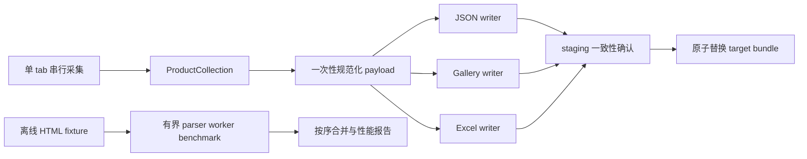

# 商品采集本地流水线并发、性能与空间优化设计

## 文档信息

- 日期：2026-07-17
- 基线提交：`aa08116 fix: finalize product gallery quality rendering`
- 适用子系统：`web-scraping.dev` 商品采集、三产物输出与离线验收
- 设计状态：已完成设计讨论，等待文档复核后再拆 implementation plan

## 1. 背景与现状

当前商品链路已经完成以下闭环：

```text
受控浏览器采集
  -> ProductCollection
  -> products.xlsx / products.json / gallery.html
  -> 离线 bundle verifier
  -> 自包含商品画廊
```

最近一轮完成了画廊数据质量表达、`PARTIAL` 原因、未分类筛选、证据侧栏、响应式布局和可访问性增强。现有实现已经具备稳定的离线测试与原子输出能力，但本地流水线仍有三类可优化点：

1. `ProductOutputBundle` 写入 JSON、画廊和 Excel 时，会重复构造 primitive payload；
2. 输出阶段会重复做对象转换、JSON 序列化和部分落盘后的读取校验；
3. 失败诊断、临时 staging/backup 目录和长期 `artifacts/` 产物缺少统一的空间控制入口。

当前可观测基线如下：

| 项目 | 当前观测 |
| --- | --- |
| 全量离线测试 | `.venv` 中 243 passed |
| gallery 目标测试 | 12 passed |
| 示例 `gallery.html` | 约 34 KB |
| 示例 `products.json` | 约 2 KB |
| 示例 `products.xlsx` | 约 5.6 KB |
| 当前 `artifacts/` | 约 1.56 MB，包含截图、HTML 和日志 |
| `.worktrees/`、`.venv/` | 分别约 345 MB、56 MB，属于开发环境，不是本轮运行时产物 |

真实站点运行的时间下限仍由访问规则决定。商品站点必须使用有头浏览器、`--max-products 1..10` 和 `--min-interval >= 2`；最多 10 条时，列表页加 10 个详情页的节流等待本身就约为 22 秒。本轮不把降低该等待作为性能目标。

## 2. 目标

- 在不改变真实站点访问规则的前提下，减少本地输出阶段的 CPU、序列化和写盘耗时。
- 使 JSON、HTML、Excel 使用同一份规范化 payload，避免重复对象转换。
- 在本地输出阶段引入固定上限的并发，保持三产物原子提交和确定性顺序。
- 控制快照队列、诊断文件和临时目录的内存与磁盘增长。
- 建立可重复的离线性能基准，区分网络等待与本地处理耗时。
- 保持现有 schema、状态语义、错误处置和离线自包含画廊能力。

## 3. 非目标与不变量

### 3.1 非目标

- 不增加多 tab、多浏览器或多进程的真实站点抓取模式。
- 不并发访问 `web-scraping.dev`，不降低 `--min-interval`，不扩大 `--max-products`。
- 不修改豆瓣电影采集链路、MiniMax 延期策略或现有 live 授权门禁。
- 不修改商品 JSON schema、Excel 列顺序、金额类型、时间格式或状态枚举。
- 不将 `.venv/`、`.worktrees/`、`browser-profile/`、`outputs/` 或 `artifacts/` 运行时文件加入 Git。
- 不通过删除诊断证据来换取速度；成功记录仍不生成截图和 HTML，失败记录仍遵循脱敏规则。

### 3.2 必须保持的不变量

- 真实站点访问保持单浏览器会话、单 tab、串行导航。
- `BLOCKED`、429、挑战页、登录/安全检查和站外跳转仍然立即停止 batch。
- 网络错误仍只使用现有有限重试和 2/5 秒退避；并发不得制造额外重试。
- 输出顺序与 `ProductCollection.records` 顺序一致。
- 三个输出文件必须来自同一次不可变 `ProductCollection`，并继续通过 bundle verifier。
- 任一输出失败时，旧 bundle 必须保持可用，staging 必须被清理或恢复。
- 诊断截图只能来自失败发生时仍对应的页面；不能由其他 worker 复用已经变化的 tab。

## 4. 方案选择

### 方案 A：本地输出管线并发（采用）

在浏览器采集完成后构造一次规范化 payload，再使用固定最多 3 个本地 worker 并行生成 JSON、HTML 和 Excel。所有 writer 完成后再做一致性确认和原子目录替换。

优点是边界清晰、不会增加真实请求、容易测试，也能直接消除当前重复序列化和重复对象转换。缺点是商品数量上限为 10 时，输出本身较小，实际收益需要 benchmark 证实。

### 方案 B：live 详情页多 tab 并发（不采用）

通过多个 tab 同时访问商品详情页，理论上可以降低网络等待，但会改变当前请求节奏、扩大阻断面，并且无法证明符合目标站点的聚合频率要求。该方案不进入本轮实现。

### 方案 C：live 采集与 detached parser 管线（受限保留）

将详情页 HTML 从浏览器 tab 中复制成快照，再交给本地 parser worker。该方向只在离线 fixture benchmark 中实现，用于验证 parser 可并行化；生产 live 路径继续采用当前“导航、解析、诊断绑定在同一 tab 生命周期内”的串行路径。

如果未来要将 detached parser 提升到 live 默认路径，必须先补齐页面快照诊断契约，证明 `PAGE_CHANGED` 等失败仍能产生正确证据；在此之前，任何无法绑定诊断的任务都必须回退到串行处理。

## 5. 总体架构



### 5.1 Live 采集层

`ProductRunner` 的真实站点路径保持现状：

- discovery 和 detail navigation 都通过同一个 `_paced()` 路径；
- 浏览器访问、重试、阻断判定和页面诊断不交给线程池；
- `ProductRunner` 仍然按 listing 顺序生成 `ProductRecord`；
- 采集结束后才进入本地输出并发层。

这样可以明确区分：

```text
live elapsed = network navigation + required pacing + current-page diagnostics
local elapsed = payload + render + write + verify
```

本轮只优化 `local elapsed`，不对 live elapsed 做不合规的并发改造。

### 5.2 规范化输出快照

新增一个内部输出快照概念，包含：

- 原始的不可变 `ProductCollection`；
- 一次生成的 `product_payload(collection)` 字典；
- 与 payload 中 `products` 对应的 primitive rows；
- 紧凑 JSON 文本；
- 期望的 product ID 顺序、数量和状态摘要。

该快照只在当前 `write()` 调用内存活，不写入仓库，不跨 run 缓存，也不允许 writer 修改其中的数据。

公共渲染函数继续兼容当前直接调用方式：如果调用者没有传入快照，则自行建立；`ProductOutputBundle` 则显式建立一次并传递给三个 writer。

### 5.3 输出并发层

`ProductOutputBundle._write_three()` 使用标准库 `concurrent.futures` 建立最多 3 个本地任务：

- JSON writer 只写 `products.json`；
- gallery writer 只写 `gallery.html`；
- Excel writer 只写 `products.xlsx`。

三个任务写入同一个唯一 staging 目录中的不同文件，不共享可变 writer 状态。所有任务完成后，主线程执行一致性检查并沿用现有 staging → backup → target 原子替换流程。

固定 worker 上限为 3，不新增 CLI 参数让操作员把本地线程数无限调大。真实 live 访问不进入该线程池。

## 6. 数据、错误与取消流程

### 6.1 正常流程

1. `ProductRunner` 按现有规则返回一个 `ProductCollection`。
2. `ProductOutputBundle` 合并已有 workbook 记录，生成最终 `merged_collection`。
3. 只调用一次 payload builder，并冻结期望 ID、状态和数量。
4. 创建 staging 目录。
5. 并行运行 JSON、gallery、Excel writer。
6. 等待三个 writer 全部成功。
7. 用 writer receipt、JSON payload 和文件存在性做轻量一致性确认。
8. 保留现有 bundle verifier 作为完整离线验收工具。
9. 原子替换目标目录并清理 backup。

### 6.2 阻断与取消

- 真实采集中的 `BLOCKED` 仍由 browser lane 立即处理，线程池不会掩盖或延迟它。
- 本地 benchmark 中出现模拟阻断时，停止提交新的快照，取消尚未开始的 parser future；已运行的纯本地 parser 允许自然结束，但结果不再追加到已停止 batch。
- 输出 writer 任一抛出异常时，主线程取消尚未开始的 writer future，等待已运行 writer 退出，删除 staging 并恢复 backup。
- `OutputLockedError` 仍映射为现有 `OUTPUT_LOCKED` 语义，不能因为并发而覆盖旧文件。
- 所有 executor 使用上下文管理或等价的 `shutdown(wait=True, cancel_futures=True)`，不得遗留后台线程。

### 6.3 诊断回退

生产 live 路径不改变当前诊断绑定：失败页面仍由当前 tab 立即捕获。离线 detached parser 只处理 fixture 或已经具备完整快照的输入；如果 future 结果无法提供与原始页面对应的证据，测试必须验证串行 fallback，而不是生成猜测截图。

## 7. 空间控制设计

### 7.1 Payload 与输出文件

- `products.json` 改为紧凑 JSON，仅移除缩进空白，保留 UTF-8、字段内容、schema_version、数组顺序和末尾换行。
- gallery 的内嵌 JSON 继续使用紧凑序列化，不重复嵌入第二份商品 payload。
- JSON、gallery、Excel writer 复用同一份 primitive rows，避免每个 writer 再次调用 `asdict()`。
- 不对 Excel 做二次压缩或改变列契约；`.xlsx` 仍由 openpyxl 生成。

### 7.2 内存边界

- 离线 parser benchmark 的快照队列默认上限为 2。
- 快照只保留完成解析所需的 HTML、listing 和 final URL；解析完成后立即释放 HTML 引用。
- 不为成功页面持久化原始 HTML 或截图。
- 输出 writer 只共享规范化 payload，不复制完整 `ProductCollection`。

### 7.3 运行产物清理

新增显式的离线清理入口，默认只预览：

```powershell
python -m scripts.prune_artifacts --root .\artifacts --older-than-days 7
python -m scripts.prune_artifacts --root .\artifacts --older-than-days 7 --apply
```

清理规则：

- 默认不删除任何文件；只有带 `--apply` 才执行删除；
- 只允许 root 解析到仓库内的 `artifacts/`；
- 只删除超过保留天数的文件，不递归删除 `browser-profile/`、`outputs/`、`.venv/` 或 `.worktrees/`；
- 删除前输出绝对路径、大小和最后修改时间；
- 任何不在允许 root 下的路径直接拒绝。

`ProductOutputBundle` 增加陈旧 sibling 清理能力，只匹配自身生成的 `.<target>.staging-*` 和 `.<target>.backup-*`，默认只处理超过 24 小时的目录。成功/失败流程原有的即时清理仍然保留。

## 8. 代码边界与文件变更

### 8.1 允许修改

- `app/product_json.py`
  - 增加内部 output snapshot builder；
  - 提供紧凑 JSON 渲染；
  - 保持 `product_payload()` 与 `render_product_json()` 的直接调用兼容。
- `app/product_gallery.py`
  - 支持复用 output snapshot；
  - 保持现有 HTML escaping、离线自包含和外部依赖禁止规则。
- `app/product_excel.py`
  - 支持复用 primitive rows；
  - writer 返回用于轻量校验的 receipt，不改变 Excel 列契约。
- `app/product_output_bundle.py`
  - 一次建立 payload；
  - 并行执行三个 writer；
  - 保留原子交换、旧 bundle 恢复和输出锁语义；
  - 增加生成目录的陈旧 sibling 清理。
- `app/product_runner.py`
  - 增加本地 benchmark 所需的阶段计时或纯函数适配入口；
  - 不改变 live navigation、retry、pacing 和 block 行为。
- `scripts/benchmark_products.py`
  - 新增完全离线的固定 fixture/fake-adapter benchmark；
  - 输出阶段耗时、峰值内存、队列深度和文件字节数。
- `scripts/prune_artifacts.py`
  - 新增 dry-run 默认的诊断产物清理工具。
- `tests/test_product_json.py`
- `tests/test_product_gallery.py`
- `tests/test_product_excel.py`
- `tests/test_product_output_bundle.py`
- `tests/test_product_runner.py`
- `tests/test_benchmark_products.py`
- `tests/test_prune_artifacts.py`
- `README.md`
  - 增加性能指标解释、离线 benchmark 命令和清理命令。

### 8.2 不允许修改

- `app/sites/douban_movie.py`
- `app/sites/web_scraping_dev.py` 的 live URL 白名单、阻断检测和访问边界
- `app/browser_session.py` 的 profile、headed 和浏览器生命周期门禁
- 商品 JSON schema 定义和 Excel `PRODUCT_COLUMNS`
- `.github/workflows/core-offline.yml` 的离线网络边界
- 任何运行时产物目录中的文件

## 9. 可观测性与 benchmark

### 9.1 记录指标

每次离线 benchmark 输出结构化结果，至少包含：

- `records`、`iterations`；
- `payload_build_ms`；
- `json_write_ms`、`gallery_write_ms`、`excel_write_ms`；
- `verify_ms`、`total_local_ms`；
- `writer_workers`、`parser_workers`、`max_queue_depth`；
- `peak_memory_bytes`；
- `products_json_bytes`、`gallery_html_bytes`、`products_xlsx_bytes`、`bundle_bytes`。

真实 live 日志只增加本地阶段耗时和网络访问次数，不记录 HTML、Cookie、请求头、profile 路径或敏感字段。

### 9.2 Benchmark 规则

- 只读取 `tests/fixtures/` 和 fake adapter，不启动浏览器、不访问目标网站。
- 固定 1、5、10 条商品规模，每个规模至少运行 5 次；报告中位数与最大值。
- baseline 与优化版使用同一个 `.venv`、同一组 fixture、同一台机器和同一输出格式。
- 不把 benchmark 生成的 JSON、Excel、HTML 或报告写入 Git 跟踪目录；临时目录由测试框架或系统临时目录托管。

## 10. 验收标准

### 10.1 功能与安全

- 全量 `pytest -q` 通过，现有 243 个基线用例无回归。
- `products.json` 解析后与旧版 schema、记录内容和顺序一致。
- gallery 仍可断网或直接双击打开，无外部 script、字体、`fetch`、XHR 或 WebSocket。
- `scripts.verify_products` 对生成 bundle 返回正确的 products、unique_ids、success、partial、failed 计数。
- 模拟 `BLOCKED`、输出锁定、writer 失败时，旧 bundle 完整保留且没有残留 staging/backup。
- 真实 live 路径的 adapter 调用顺序保持串行；测试不得出现并发的 `tab.get()`。
- 清理工具默认 dry-run，越界路径、非允许目录和非过期文件均不会被删除。

### 10.2 性能与空间

- 每次 `ProductOutputBundle.write()` 的 payload builder 调用次数为 1。
- 每条 record 的 primitive 转换次数为 1；writer 不再独立调用 `asdict()` 生成副本。
- 本地输出阶段 benchmark 中位耗时不劣于 baseline，目标在 10 条 fixture 上降低至少 15%。
- 紧凑 `products.json` 的字节数小于或等于 baseline；bundle 总大小不得因为并发改造增加超过 5%。
- parser benchmark 的最大快照队列深度不超过 2；输出 worker 数不超过 3。
- 成功 run 和失败回退结束后，目标 bundle 目录旁不存在本轮新建的 staging/backup sibling。
- 诊断清理 dry-run 能列出文件大小和路径；`--apply` 只删除符合 root、年龄和文件类型规则的目标。

### 10.3 受控 live 验收

本 spec 不自动批准真实网络访问。若之后进行 live 验收，必须由操作员在该次命令中重新提供：

```text
--live-approved --max-products N --headed --min-interval 2
```

并且仍需在 429、阻断、挑战、登录或站外跳转时立即停止。live 验收只核对访问次数、串行顺序、状态语义和三产物一致性，不以并发提高网络吞吐。

## 11. 实施顺序

1. 为 payload 调用次数、primitive 转换次数、compact JSON 和输出顺序补失败测试。
2. 增加内部 output snapshot 与 writer receipt，先保持三个 writer 串行验证基线。
3. 将 JSON、gallery、Excel 写入 staging 的步骤改为最多 3 个本地 worker。
4. 补充 writer 异常、取消、旧 bundle 恢复和陈旧 sibling 清理测试。
5. 增加离线 parser benchmark 和资源指标，不把 detached parser 默认接入 live runner。
6. 增加 `prune_artifacts` dry-run/`--apply` 工具与 README 说明。
7. 运行 focused tests、全量离线测试、bundle verifier、`pip check` 和 benchmark。
8. 使用已有本地产物做人工 gallery 回归；不创建新的 live 运行产物。

## 12. 回滚边界

如果并行 writer 或紧凑输出导致静态契约失败，只回滚本轮 output snapshot、writer 并发、compact JSON 和清理工具改动，恢复现有串行输出；不回滚已经验证的商品采集器、站点访问边界、live 门禁、领域模型和画廊质量修复。

回滚不得删除 `outputs/`、`artifacts/` 或 `browser-profile/` 中用户已有的运行产物。任何陈旧目录清理都必须先通过 dry-run 输出并由操作员显式执行 `--apply`。

## 13. 完成定义

- 本 spec 对范围、并发边界、空间策略、错误回退、性能指标和验收命令均有明确约定。
- 所有新增并发仅发生在本地或离线 fixture 阶段；真实网站访问仍为串行限速。
- 三产物保持同一份 `ProductCollection`、相同 ID 顺序和既有 schema。
- 全量离线测试、依赖检查、差异检查和 bundle verifier 均通过。
- benchmark 结果记录在交付回报中，包含 baseline、优化版、运行环境、耗时和字节数。
- 文档、代码和测试提交不包含任何运行时文件、截图、HTML 证据、Cookie、API Key 或 profile 数据。
